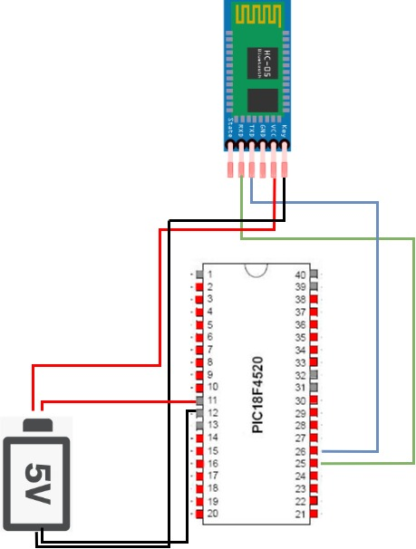
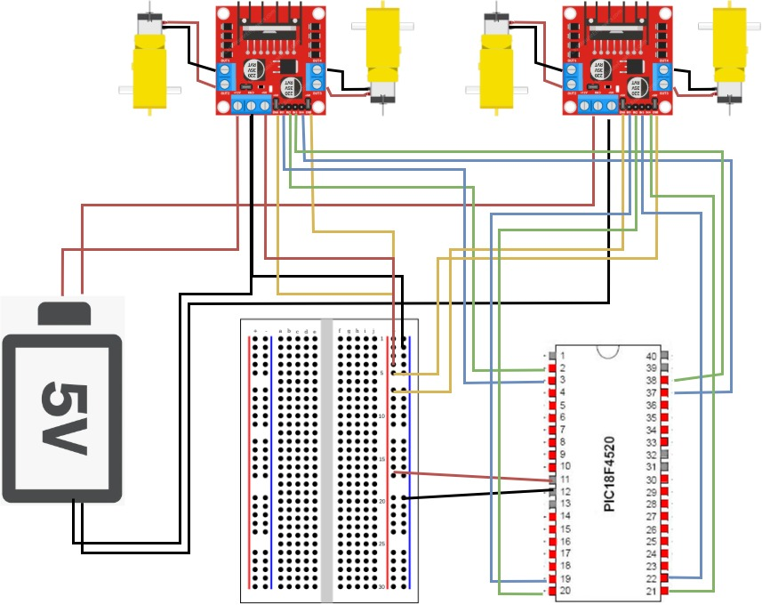
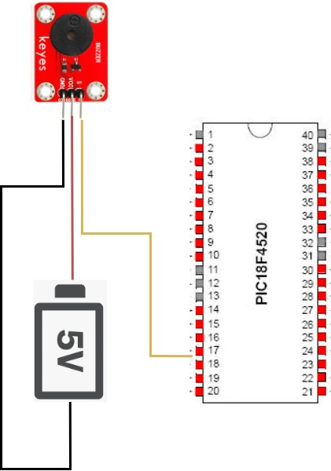
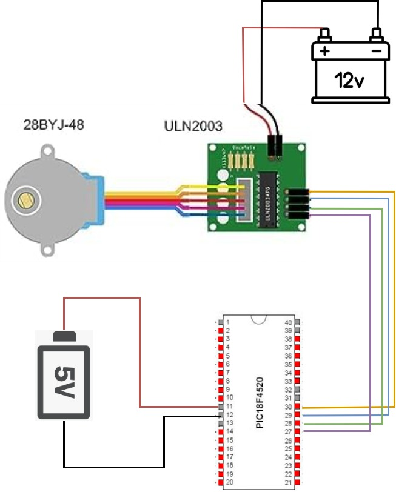

# 微算機


# 微算機期末專題文件 主題：藍芽遙控消防車

## 一、系統功能與原理說明 
### 藍芽控制（遙控車、背景音樂、雲梯）
使用自撰Android app送出特定訊號，經由藍牙模組和PIC18F遠端控制直流馬達、無源蜂鳴器、步進馬達，個別對應到遙控車(L298N馬達模組)、音樂播放(蜂鳴器模組)、雲梯(ULN2003驅動板 + 28BYJ-48步進馬達)功能。
### 環境感測器及對應裝置
使用火焰感測模組、煙霧感測模組、光敏電阻模組，當模組偵測到特定事件發生，透過PIC18F啟動對應的裝置：通電沉水馬達來消滅火源、通電直流馬達風扇來驅散煙霧、通電LED以照亮環境。
### SD卡模組
我們使用SD卡模組和FatFS檔案系統模組，於特定時機將帶有即時ADC value的字串寫入至microSD card，作為煙霧感測器的日誌，以監控煙霧情況。

## 二、系統使用環境及對象 
### 環境
火災現場、防災教育場所
### 對象
消防人員、教育用途

## 三、系統完整架構圖、流程圖、電路圖、設計 
### 系統架構圖

<div style="text-align: center;">
  
</div>

### 系統流程圖

<div style="text-align: center;">
  <table style="margin: 0 auto; border-collapse: collapse; text-align: center;">
    <tr>
      <th style="border: 1px solid #000; padding: 8px;">流程名稱</th>
      <th style="border: 1px solid #000; padding: 8px;">流程圖</th>
    </tr>
    <tr>
      <td style="border: 1px solid #000; padding: 8px;">火焰感測相關流程</td>
      <td style="border: 1px solid #000; padding: 8px;">
        
      </td>
    </tr>
    <tr>
      <td style="border: 1px solid #000; padding: 8px;">光線感測相關流程</td>
      <td style="border: 1px solid #000; padding: 8px;">
        
      </td>
    </tr>
    <tr>
      <td style="border: 1px solid #000; padding: 8px;">煙霧感測相關流程</td>
      <td style="border: 1px solid #000; padding: 8px;">
        
      </td>
    </tr>
    <tr>
      <td style="border: 1px solid #000; padding: 8px;">藍芽APP相關流程</td>
      <td style="border: 1px solid #000; padding: 8px;">
        
      </td>
    </tr>
    <tr>
      <td style="border: 1px solid #000; padding: 8px;">遙控車相關流程</td>
      <td style="border: 1px solid #000; padding: 8px;">
        
      </td>
    </tr>
    <tr>
      <td style="border: 1px solid #000; padding: 8px;">音樂相關流程 (切換曲目)</td>
      <td style="border: 1px solid #000; padding: 8px;">
        
      </td>
    </tr>
    <tr>
      <td style="border: 1px solid #000; padding: 8px;">音樂相關流程 (撥放音樂)</td>
      <td style="border: 1px solid #000; padding: 8px;">
        
      </td>
    </tr>
    <tr>
      <td style="border: 1px solid #000; padding: 8px;">雲梯相關流程</td>
      <td style="border: 1px solid #000; padding: 8px;">
        
      </td>
    </tr>
  </table>
</div>


### 系統電路圖

<div style="text-align: center;">
  <table style="margin: 0 auto; border-collapse: collapse; text-align: center;">
    <tr>
      <th style="border: 1px solid #000; padding: 8px;">電路名稱</th>
      <th style="border: 1px solid #000; padding: 8px;">電路圖</th>
    </tr>
    <tr>
      <td style="border: 1px solid #000; padding: 8px;">藍芽模組電路</td>
      <td style="border: 1px solid #000; padding: 8px;">
        
      </td>
    </tr>
    <tr>
      <td style="border: 1px solid #000; padding: 8px;">遙控車電路</td>
      <td style="border: 1px solid #000; padding: 8px;">
        
      </td>
    </tr>
    <tr>
      <td style="border: 1px solid #000; padding: 8px;">蜂鳴器電路</td>
      <td style="border: 1px solid #000; padding: 8px;">
        
      </td>
    </tr>
    <tr>
      <td style="border: 1px solid #000; padding: 8px;">雲梯電路</td>
      <td style="border: 1px solid #000; padding: 8px;">
        
      </td>
    </tr>
    <tr>
      <td style="border: 1px solid #000; padding: 8px;">煙霧感測+SD卡+風扇電路</td>
      <td style="border: 1px solid #000; padding: 8px;">
        
      </td>
    </tr>
    <tr>
      <td style="border: 1px solid #000; padding: 8px;">火焰感測+沉水馬達電路+光線感測+LED電路</td>
      <td style="border: 1px solid #000; padding: 8px;">
        
      </td>
    </tr>
  </table>
</div>


### 系統設計
#### APP介面

<div style="text-align: center;">
  
</div>


---

## 四、系統開發工具、材料及技術 
我們使用MPLAB X IDE v5.20和MPLAB® PICkit™ 4 In-Circuit Debugger作為我們的系統開發工具；材料的部分：
* PIC18F4520
* MQ2煙霧感測模組
* L298N馬達模組
* 3Pin紅外線火焰感測模組
* 光敏電阻模組
* HC06藍芽模組
* microSD卡讀寫模組
* 直流馬達
* ULN2003驅動板 + 28BYJ-48步進馬達
* 無源蜂鳴器
* TIP120
* LED、電阻、二極體、杜邦線...

系統技術有用到UART、Interrupt、Timer、PWM、ADC、SPI等等。

## 五、周邊接口或 Library 及 API 使用說明 
### SPI 相關設定
對於不同階段的SD卡，我們做出了相關的SPI設定：
```c=
void SPI_Initialize(void) {
    SSPSTAT = 0x40; // CKE=1, SMP=0
    SSPCON1 = 0x22; // Master FOSC/64 => ~125kHz
    SSPCON1bits.SSPOV = 0;
    SSPCON1bits.WCOL  = 0;
    SSPADD = 0x00;
}

void SPI_Open(void) {
    SSPSTAT = 0x40; // CKE=1, SMP=0
    SSPCON1 = 0x20; // Master FOSC/4 => 2 MHz
    SSPCON1bits.SSPOV = 0;
    SSPCON1bits.WCOL  = 0;
    SSPADD = 0x00;
}

```
撇除掉一些C語言內建的library外，主要使用到的特殊library為[FatFs](http://elm-chan.org/fsw/ff/)，FatFs 是適用於小型嵌入式系統的通用 FAT/exFAT 檔案系統模組，其幫助我們將SD卡掛載並將指定字串內容寫入指定文字檔中。我們使用了以下API：
### f_mount
```c=
FRESULT f_mount (
  FATFS*       fs,    /* [IN] Filesystem object */
  const TCHAR* path,  /* [IN] Logical drive number */
  BYTE         opt    /* [IN] Initialization option */
);
```
在我們的final project中，我們如此使用`f_mount`：
```c=
FATFS FatFs;	/* FatFs work area needed for each volume */
FRESULT res = f_mount(&FatFs, "", 1);
```
若`res == 'FR_OK'`，表示SDcard掛載成功，可以繼續下去。
### f_open
```c=
FRESULT f_open (
  FIL* fp,           /* [OUT] Pointer to the file object structure */
  const TCHAR* path, /* [IN] File name */
  BYTE mode          /* [IN] Mode flags */
);
```
我們利用`f_open`來創建或開啟一個文字檔，以便以後進行字串的寫入。
在我們的final project中，我們是如此使用`f_open`：
```c=
f_open(&Fil, "hello.txt", FA_OPEN_ALWAYS | FA_READ | FA_WRITE)
```
若檢查其回傳值`'FR_OK'`，即表示成功。
### f_lseek
```c=
FRESULT f_lseek (
  FIL*    fp,  /* [IN] File object */
  FSIZE_t ofs  /* [IN] Offset of file read/write pointer to be set */
);
```
使用`f_lseek`的目的是，為了在每次讀寫新字串時，讓指針找到開始讀寫的位置，我們如此使用`f_lseek`：
```c=
// Move pointer to the end before writing
if (Fil.fsize != 0) f_lseek(&Fil, Fil.fsize);
```
### f_write
```c=
FRESULT f_write (
  FIL* fp,          /* [IN] Pointer to the file object structure */
  const void* buff, /* [IN] Pointer to the data to be written */
  UINT btw,         /* [IN] Number of bytes to write */
  UINT* bw          /* [OUT] Pointer to the variable to return number of bytes written */
);
```
我們使用`f_write`來寫入字串到SD卡內的文字檔中。使用範例：
```c=
UINT bw;
char buffer[64]; // store formatted string
UINT length = 0;
unsigned int adc_value = ADC_Read();
// use sprintf to get formatted string
sprintf(buffer, "ADC_value: %d\r\n", adc_value);
length = strlen(buffer); // get string length
f_write(&Fil, buffer, length, &bw);	
```
### f_close
```c=
FRESULT f_close (
  FIL* fp     /* [IN] Pointer to the file object */
);
```
我們使用`f_close`做為每次寫入結束的收尾。
```c=
/* File object needed for each open file */
FIL Fil;
f_close(&Fil);
```

## 六、遇到的困難及如何解決
### SD卡寫入不穩定問題
我們使用polling的方法，當偵測到火焰/煙霧感測器訊號就寫入對應字串，但是發現寫入的結果有亂碼產生。
解決方法：
>對於同一個電壓供應至多個設備（PIC18F4520、火焰感測器、煙霧感測器、SD卡讀寫模組），容易有供電不穩的情形，後來便決定把火焰感測器獨立交由另一個PIC18F4520控制，並只根據煙霧感測器產生的ADC_value寫入字串，便沒有上述問題了。此外，對於多個模組的供電，本來都是行充接單一TTL線的5V供電，我們後來使用多個供電來源，如TTL 5V * 2 、 (3.5V + 3.5V = 7V) * 1等等，來盡量避免設備供電的不穩定。

### 直流&沉水馬達控制問題
單純將PIC18F之輸出引腳連至馬達是無法直接控制的，因為PIC18F4520的輸出引腳電流太小，無法直接驅動馬達。
解決方法：
我們將馬達獨立供電，並使用TIP120電晶體來幫忙控制，接線方式：
> 馬達的一端連接到電源正極。
馬達的另一端連接到 TIP120 的集電極 (C)。
TIP120 的射極 (E) 接地 (GND)。
在馬達的兩端並聯一個飛輪二極體，二極體的陰極（白條一端）接電源正極，陽極接馬達另一端，防止反向電流損壞 TIP120。
Base (B) 經過一個 1kΩ 電阻連接到 PIC18F4520 的輸出引腳。

PIC18F4520 的輸出：
> PIC18F4520 的 I/O 引腳輸出高電平時，TIP120 導通，馬達開始運轉。
輸出低電平時，TIP120 截止，馬達停止。


### 遙控車操控效果調整
我們希望將遙控車的控制方式從 (按下一次控制鍵就會一直移動，且直到按下停止鍵才會停下) 改為 (一直按著某個鍵才會移動，放開後就立即下)。
所以需要在沒有接收到w、a、s、d的時候就立刻將馬達暫停。但衍生出來的問題則是，檢查輸入的速度過快，導致即便一直按著按鍵，車子也只會走走停停。
解決方法：
> 首先在每次接收到w、a、s、d並啟動馬達後，加一個短短的delay(80ms)
> 不過這樣的方法不足以讓車子順暢地前進，還需要確保藍芽app的發送頻率夠快，才能達成預期的效果。
> 不過目前看到的藍芽app沒有看到調整發送頻率(持續按著按鈕的情況下)的功能。所以我們決定自製一個app，而app的發送頻率可以根據我們的需求自己調整

### 音樂播放和藍芽控制之衝突
原先最直覺的音樂撥放方式是使用delay，讓蜂鳴器撥放某個音之後就delay這個音的持續時間。但是使用這個方法的話，就會造成無法即時處理藍牙的輸入 (*上述調整遙控車操控效果的部分有提到，我們要在沒有接收到w、a、s、d的時候就立刻將馬達暫停，所以藍芽控制用polling的方式來寫* )。
解決方法：
>為了能夠在播放音樂的同時也能夠控制車子，我們將音樂的播放改為timer interrupt的方式。音符的持續時間不再用delay來達成，而是使用timer0。
>調整PR2來讓PWM的頻率符合音符的頻率後，再調整TMR0來控制音符持續的時間。而polling的藍芽控制就可以在兩個音的間隔之間照常運行。
## 八、DEMO影片
[影片](https://youtu.be/agV0DLyJANU)
